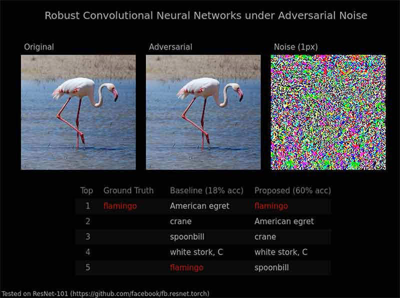

# ResNet stochastic feedforward demo

This script is mainly based on the facebook's version of ResNet https://github.com/facebook/fb.resnet.torch .
The repository contains only a minimum part of testing codes to evaluate its performance on ImageNet validation set.
Adversarial noise is generated using fast gradient sign method and added to the samples in ImageNet dataset.
During validation, standard feedforward and stochastic feedforward (the proposed work) are used respectively.


## Preparation

Here is what you need to have.
You do not need to download pretrained models since the main script will automatically do that.

+ Download ILSVRC2012 validation set
+ Install `stnn` and `stcunn` (for CUDA support) pacakges

```bash
luarocks install https://raw.githubusercontent.com/jhjin/stochastic-cnn/master/stnn-scm-1.rockspec    # cpu
luarocks install https://raw.githubusercontent.com/jhjin/stochastic-cnn/master/stcunn-scm-1.rockspec  # cuda
```


## Run

Run this if you are interested in total error on validation set

```bash
th main.lua
```


## Visualization

The command will visualize input images, and provide detailed information about prediction

```bash
qlua visualize.lua
```

as illustrated in




## Sample result on ResNet-101

The table summarizes performance of both methods with ResNet-101 when exposed to one pixel of adversarial noise.
An input variance of 0.17 was used for the stochastic feedforward.

| Method                | Noise | Top1 Error (%) | Top5 Error (%) |
|-----------------------|-------|----------------|----------------|
| standard feedforward  |  No   |         22.460 |          6.220 |
| standard feedforward  |  Yes  |         82.518 |         43.712 |
| stochastic feedforwad |  Yes  |         40.764 |         15.874 |
